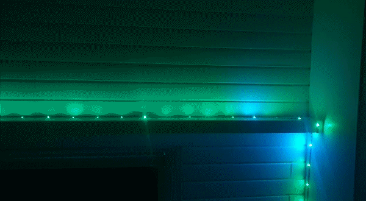
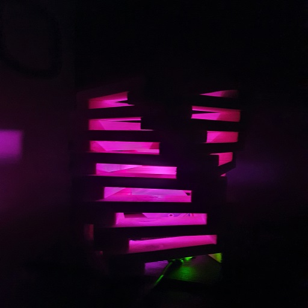
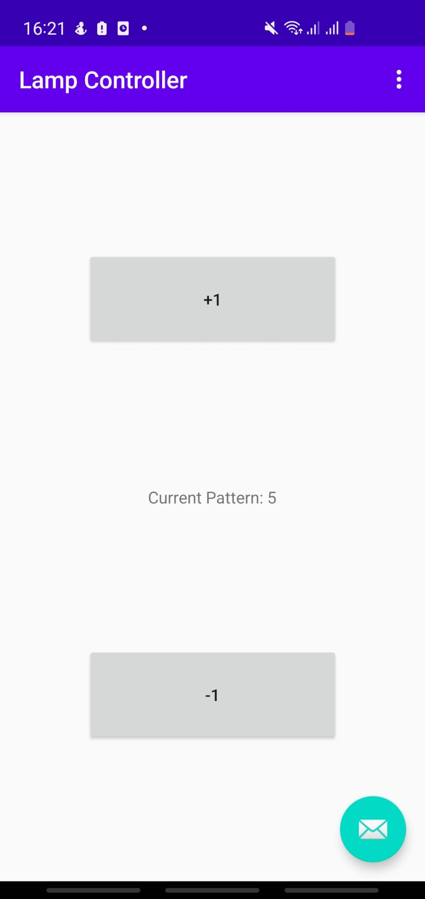
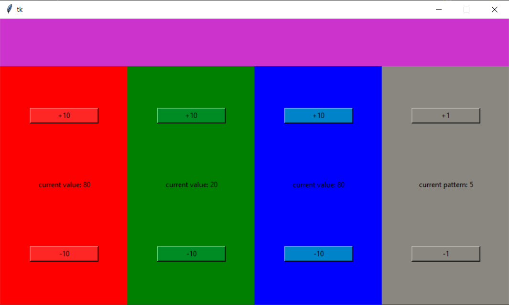

# Lamp-System

This project aims to schynchronize multiple rgb lights, which are located in remote places. To achieve this a centralized webserver is created. The webserver defines a RESTful API and accepts HTTP requests from clients such as the lamp (Esp32/Raspberry Pi) or from a remote controller (Phone/Desktop app). Another usefull tool for interaction with the webserver is an API application like Postman.

Click on the Name of each component below for additional information.

## Server
Name | Programming Language
--- | ---
[webserver](./Server/) | Java (Spring Boot)

## Lamp Implementations
Name | Programming Language | Image 
--- | --- | ---
[Esp32 + ws2812b LED strip](./Esp32/) (Click for more GIFs!) | C/C++ (Arduino Framework) | 
[Raspberry Pi + rgb-LED](./RaspberryPi/) | Python | 

## Controller Implementations
Name | Programming Language | Image
--- | --- | ---
[Android App](./Android/) | Java (Android Development) | 
[Desktop App](./Frontend/) | Python | 
